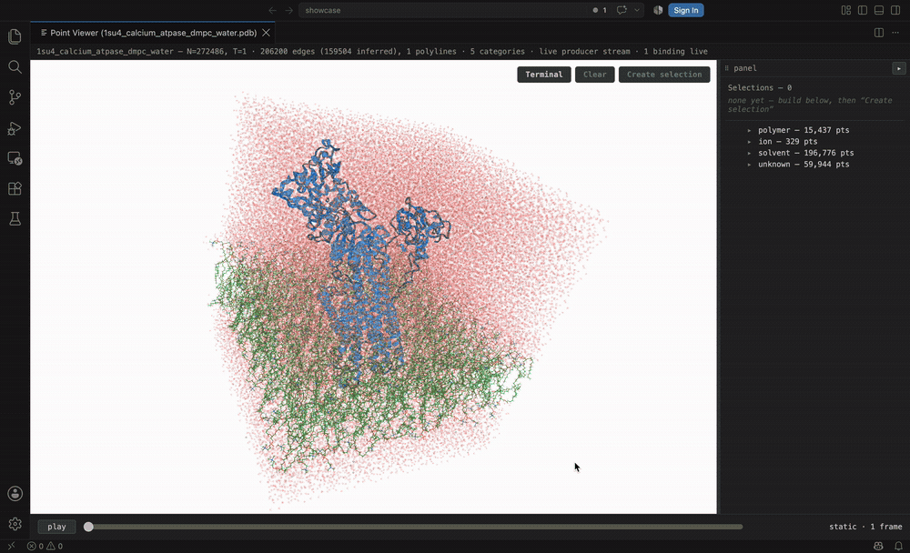
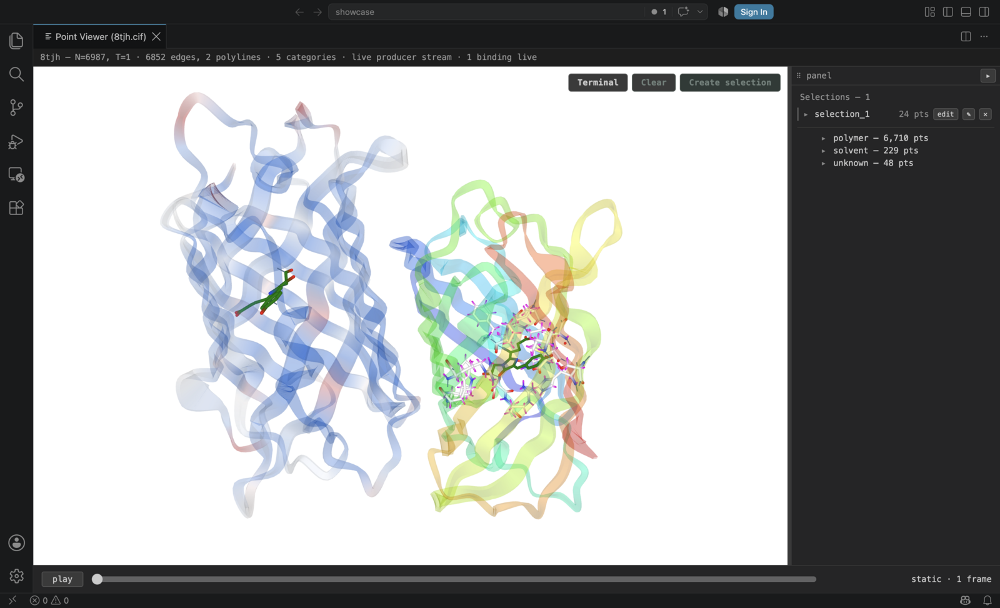

# Molaro

Molaro is a VS Code extension for streaming, exploring, and analyzing molecular
dynamics trajectories where the data lives, including on remote systems over
SSH. It combines a GPU-rendered 3D viewer, a command-driven representation
layer, Python analysis mods, and an optional Claude-powered analysis assistant.

Molaro was created for the **Build Track of Built with Claude: Life Sciences**,
a global virtual hackathon hosted by Anthropic and Cerebral Valley in partnership
with Gladstone Institutes.

## What Molaro does

- Opens molecular structures and trajectories directly from the VS Code Explorer.
- Streams trajectory frames from a Python producer into a CSP-safe Three.js
  webview instead of copying the full dataset into the editor.
- Provides interactive selection, hiding, camera controls, hierarchy navigation,
  and representations for points, bonds, and backbone traces.
- Includes a terminal grammar for selecting, styling, plotting, and composing
  analysis results.
- Runs small Python **mods** beside the trajectory and displays their results as
  plots, channels, geometry, or viewer commands.
- Offers an optional `/claude` assistant that can inspect the loaded system,
  author and run mods, and operate the viewer through a restricted tool surface
  with approval gates around writing, running, and deleting mods.

Molaro's renderer is deliberately data-neutral. Molecular files are translated
by the producer into a typed contract of positions, connectivity, hierarchy,
labels, and numeric channels; the renderer only consumes that contract.

## See Molaro in action

| Live-updating mods | Fast structure navigation |
| --- | --- |
| [](https://raw.githubusercontent.com/DomFico/molaro/main/media/demos/live-mods.mp4) | [](https://raw.githubusercontent.com/DomFico/molaro/main/media/demos/structure-navigation.mp4) |
| Run custom Python mods and apply their results immediately as channels, bindings, plots, geometry, or viewer commands. Click for the full video. | Move from a large solvated system to precise chains and residues with the hierarchy, named selections, and camera framing. Click for the full video. |

### Custom representations

Combine ribbons, atom-and-bond styles, colors, opacity, and selections in a
single scene.



## Requirements

- VS Code 1.125 or newer.
- Python 3 with NumPy for the data producer.
- [mdtraj](https://www.mdtraj.org/) 1.11 or newer for real molecular files and
  analysis mods.
- An Anthropic API key only when using the Claude analysis assistant.

Set `molaro.pythonPath` to the Python interpreter Molaro should use. This is the
recommended configuration on remote hosts because it does not depend on the
VS Code server inheriting your shell environment. `VIEWER_PYTHON` remains a
fallback when the setting is empty.

Run **Molaro: Diagnose** from the Command Palette to check the selected
interpreter, required packages, protocol output, and mods directory.

## Install

Molaro is packaged as a universal fallback VSIX and as platform-specific
packages. Install the universal package from the command line or use VS Code's
**Install from VSIX...** action:

```bash
code --install-extension molaro-0.1.1.vsix
```

Targeted packages are also built for Linux x64, macOS x64, macOS arm64, and
Windows x64. The Claude Agent SDK runtime is included only in the Linux x64
package; the universal and other targeted packages retain the viewer, terminal,
plots, and hand-written mods.

To build all packages from source:

```bash
npm ci
npm run package
```

## Open a system

1. Configure `molaro.pythonPath` with a Python environment containing NumPy and
   mdtraj.
2. In the VS Code Explorer, right-click a structure or trajectory file.
3. Select **Launch Molaro**.

Standalone structures such as `.pdb`, `.gro`, `.mol2`, `.cif`, and `.h5` open
directly. Trajectories such as `.xtc`, `.dcd`, `.trr`, and `.nc` need a companion
topology. Molaro first looks for a same-named topology beside the trajectory and
can resolve other candidates by atom count.

For a synthetic dataset that does not require mdtraj, run **Point Viewer: Open**
from the Command Palette.

## Work with the viewer

The hierarchy panel and 3D scene share the same named selections and hidden set.
Click hierarchy rows or geometry to build a selection, right-click to toggle
visibility, and drag in the scene to rotate the camera. The panel can be docked,
resized, or collapsed.

Open the built-in terminal from the viewer to drive the scene with commands:

```text
view polymer
create_sele polymer.A [chain_a]
hide solvent
colorpoints @chain_a steelblue
```

The address grammar works across categories, groups, subgroups, point types,
point indices, named selections, globs, ranges, and unions. See the
[command reference](docs/COMMANDS.md) for the full grammar and command set.

## Analysis mods

A mod is a Python file that receives the loaded trajectory and selected point
indices, then returns a typed result for Molaro to display. Mods can produce
per-frame series, scatter plots, figures, scalar fields, channels, edges, or a
sequence of viewer commands.

User mods live in `molaro.modsDir`, or `~/.molaro/mods` by default. They are
discovered and reloaded when saved. See [Writing a Molaro mod](docs/MODS.md) for
the file format, data API, return contracts, parameters, and testing workflow.

## Claude analysis assistant

Run **Molaro: Set Anthropic API Key** to store an API key in VS Code
SecretStorage, then enter `/claude` in Molaro's terminal to open the assistant.
The key can also come from `ANTHROPIC_API_KEY`.

The assistant works from the live system context and the same command and mod
interfaces available to the user. Its built-in tools are limited to reading
Molaro context, writing and running mods, running viewer commands, and deleting
workspace mods. Operations that write, execute Python, or delete a mod require
explicit approval in the panel. The assistant has no general shell or filesystem
tool through Molaro.

## Architecture

```text
VS Code extension host
  |-- TypeScript host and broker          src/
  |-- Python trajectory producer          producer/
  |-- shared wire contract                contract/
  `-- Three.js viewer and terminal        webview/
```

The extension host starts the producer and relays a length-framed protocol to
the webview. The Python side owns file loading and molecular interpretation; the
TypeScript side owns rendering, interaction, commands, plots, and assistant UI.
The boundary between them is defined in `contract/`.

More detail is available in:

- [Command reference](docs/COMMANDS.md)
- [Mod authoring guide](docs/MODS.md)
- [Command-layer architecture](docs/COMMAND_LAYER.md)
- [Changelog](CHANGELOG.md)

## Development

```bash
npm ci
npm run build
npm run typecheck
python3 -m tests.test_roundtrip
npm test
```

Open this repository in VS Code and press **F5** to launch an Extension
Development Host. Build output is written to `dist/`; `npm run package` produces
the platform-specific VSIX files.

## License

Molaro is released under the [MIT License](LICENSE). The Claude Agent SDK
dependency is distributed under its own license.
